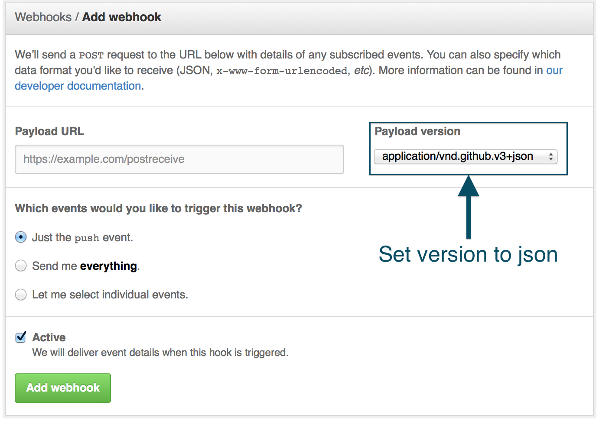

# GithubWebhook

This gem will help you to quickly setup a route in your Rails application which listens
to a [GitHub webhook](https://developer.github.com/webhooks/)

## Installation

Add this line to your application's Gemfile:

    gem 'github_webhook'

And then execute:

    $ bundle install

## Configuration

First, configure a route to receive the github webhook POST requests.

```ruby
# config/routes.rb
resource :github_webhooks, only: :create
```

Then create a new controller:

```ruby
# app/controllers/github_webhooks_controller.rb
class GithubWebhooksController < ActionController::Base
  WEBHOOK_SECRET = ENV['GITHUB_WEBHOOK_SECRET']

  def push(payload)
    # TODO: handle push webhook
  end
end

Add as many instance methods as events you want to handle in
your controller. You can read the [full list of events](https://developer.github.com/v3/activity/events/types/) GitHub can notify you about.
```

## Adding the Webhook to your git repository:

Go to the following URL:

```
https://github.com/:username/:repo/settings/hooks/new
```

You will need to fill the following form:



- Payload URL: `yourdomain.com/github_webhooks`
- Payload Version: application/vnd.github.v3+**json**
- Events: select which event you want GitHub to notify you
- Active: let it ticked if you want the webhook to work upon creation.

## Testing the GitHub webhook locally

You can use [UltraHook](http://www.ultrahook.com/)